# Active Directory Basics — TryHackMe

Documentation of my work through the TryHackMe Active Directory Basics room.

---

## Environment

- Target: Windows Server Domain Controller (`thm.local`)
- Admin host: TryHackMe AttackBox (Kali Linux)
- Tools: ADUC, GPMC, PowerShell, xfreerdp

---

## Task 2 — Windows Domains

Connected to the THM Domain Controller as Administrator.

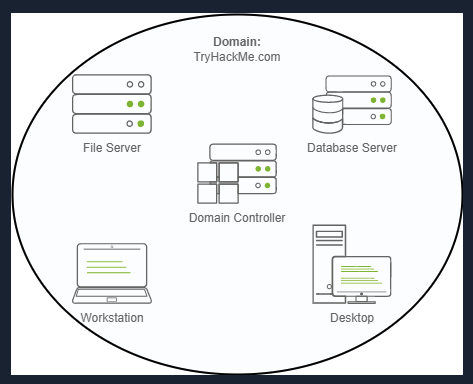

---

## Task 3 — Active Directory

Opened Active Directory Users and Computers (ADUC) and explored the `thm.local` domain. The THM OU already contained IT, Management, Marketing, Research and Development, and Sales.

Created a new OU called **Students** under THM by right-clicking THM → New → Organizational Unit.

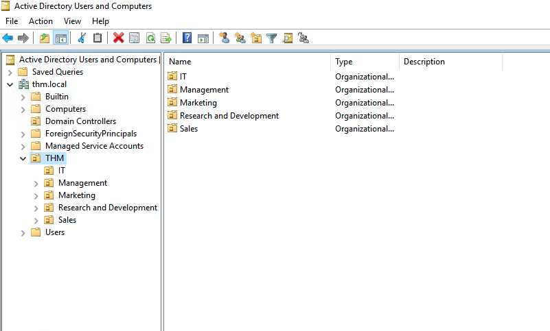
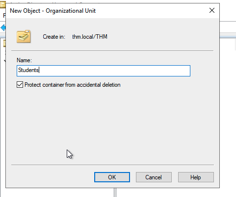
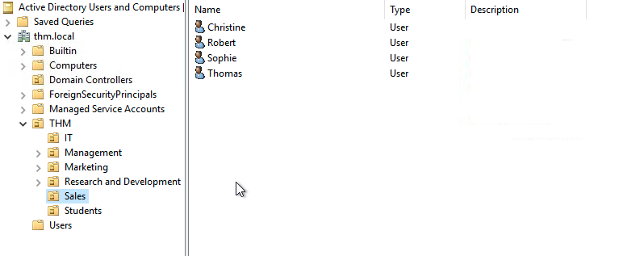

---

## Task 4 — Managing Users in AD

Reviewed the provided organizational chart to identify required changes to AD.

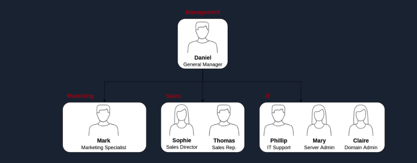

**Deleting the Research and Development OU**

First attempt to delete the R&D OU failed because of accidental deletion protection.


Enabled Advanced Features in ADUC under the View menu to expose the protection setting.

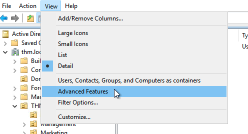

Opened the OU's Properties → Object tab → unchecked "Protect object from accidental deletion." After this, the OU could be deleted.

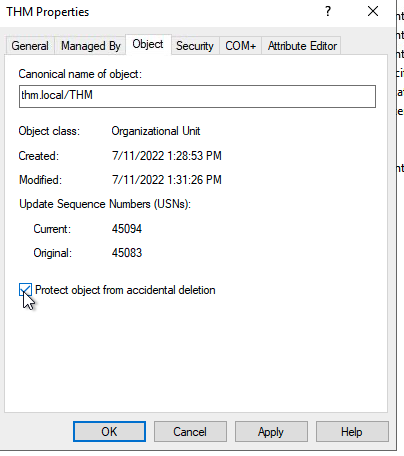

**Delegating password reset rights to Phillip**

Used the Delegate Control Wizard on the **Sales OU** to grant Phillip (IT Support) the ability to reset passwords for users in Sales.


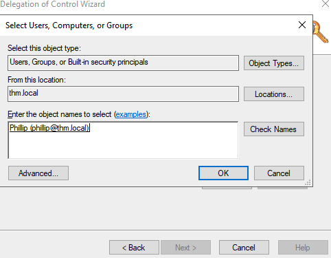


**Testing the delegation**

RDP'd into the DC as Phillip from the AttackBox:

```
xfreerdp /u:phillip /p:Claire2008 /d:THM /v:[DC_IP] /cert:ignore
```

In Phillip's PowerShell session, reset Sophie's password:

```powershell
Set-ADAccountPassword sophie -Reset -NewPassword (Read-Host -AsSecureString -Prompt 'New Password') -Verbose
```

Forced password change at next logon:

```powershell
Set-ADUser -ChangePasswordAtLogon $true -Identity sophie -Verbose
```

RDP'd in as Sophie with the new password and retrieved the flag from her desktop, confirming the delegation worked end-to-end.

---

## Task 5 — Managing Computers in AD

Default Computers container held all domain-joined machines together regardless of role.

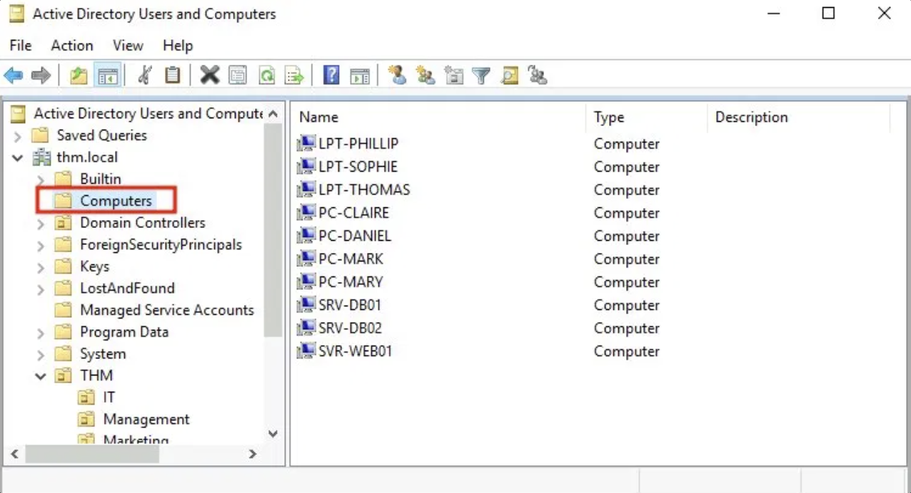

Created two new OUs under `thm.local`: **Workstations** and **Servers**.

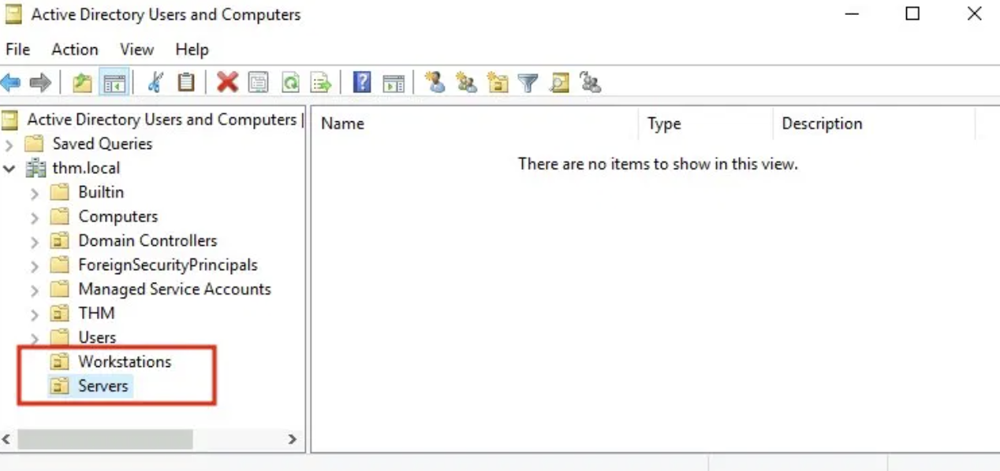

Moved 7 workstation devices (laptops + PCs) into Workstations.


Moved 3 server devices into Servers.

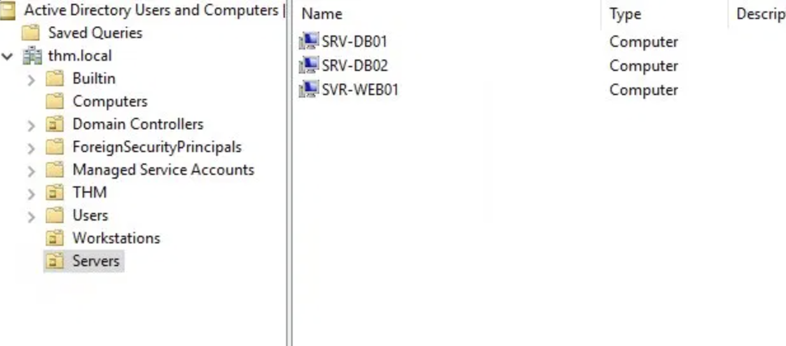

---

## Task 6 — Group Policies

Opened Group Policy Management Console (GPMC). The existing GPOs (Default Domain Policy, Default Domain Controllers Policy, RDP policy) were already linked at the domain and Domain Controllers OU level.

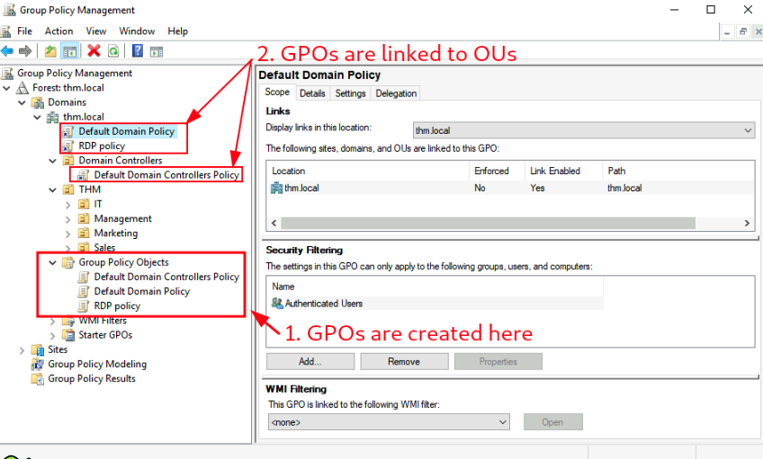
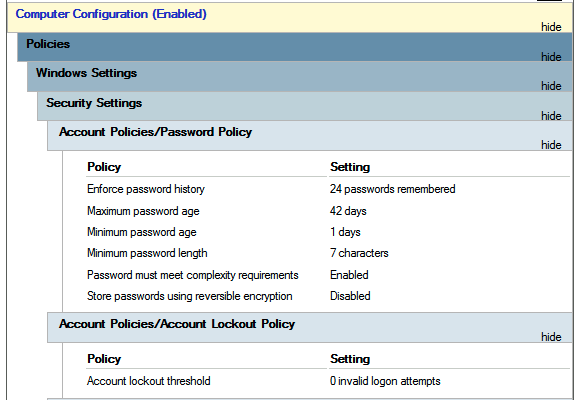

**Edited the Default Domain Policy**

Changed Minimum Password Length from 7 to 10 characters under `Computer Configuration → Policies → Windows Settings → Security Settings → Account Policies → Password Policy`.

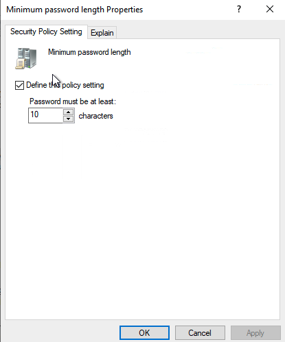
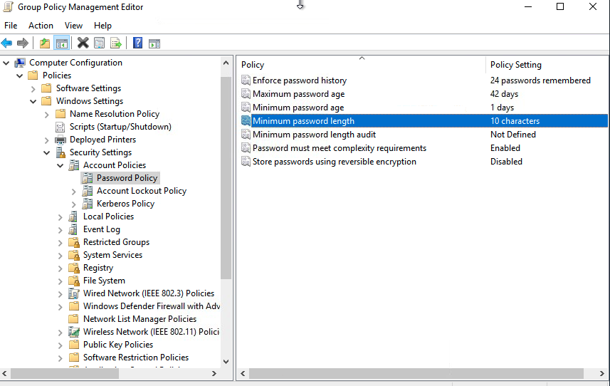

**Created the "Restrict Control Panel Access" GPO**


Edited the GPO and navigated to `User Configuration → Policies → Administrative Templates → Control Panel`.

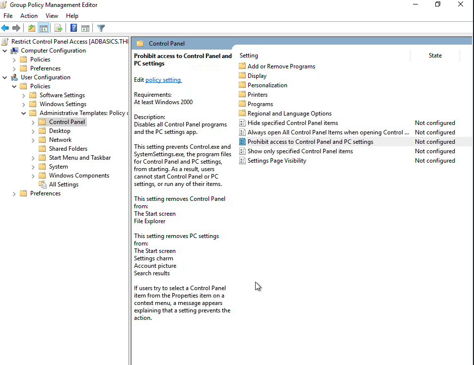

Enabled the "Prohibit access to Control Panel and PC settings" policy.

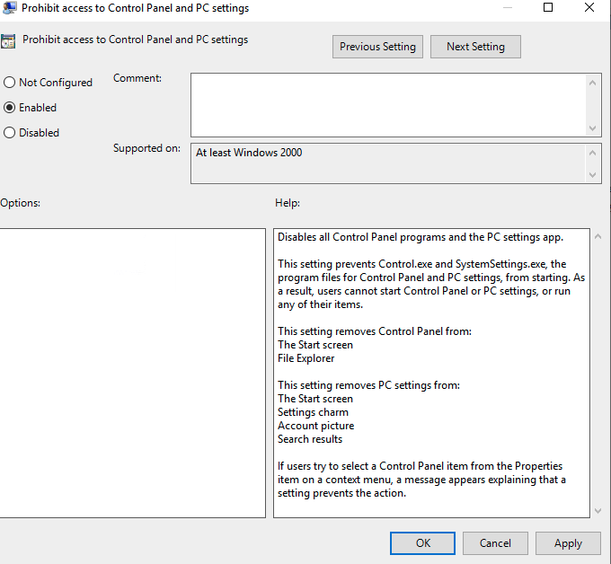

Linked the GPO to Marketing, Sales, and Management OUs using "Link an Existing GPO" via right-click on each OU.

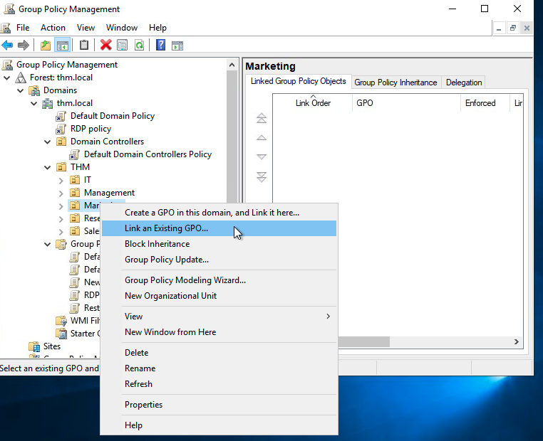
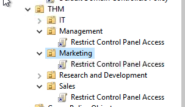

**Created the "Auto Lock Screen" GPO**

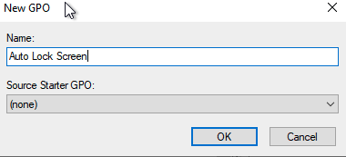

Set "Interactive logon: Machine inactivity limit" to 300 seconds (5 minutes) under `Computer Configuration → Policies → Windows Settings → Security Settings → Local Policies → Security Options`.

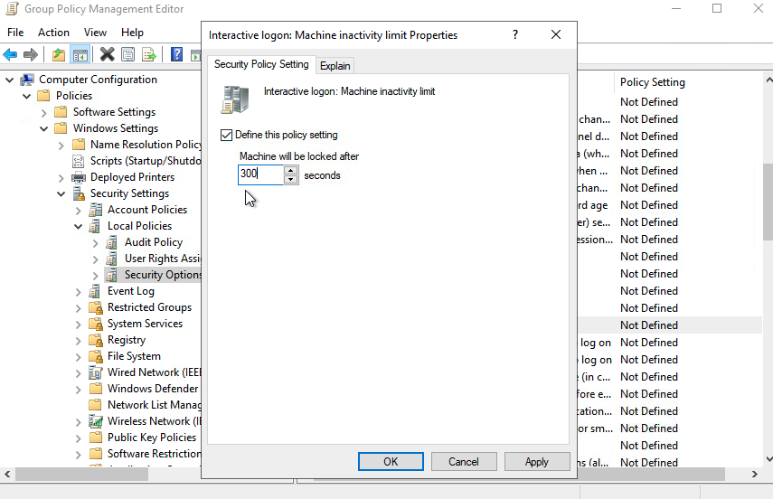

Linked the GPO to the root domain (`thm.local`) so it cascades to all computers.

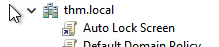

**Verifying the GPOs as Mark (Marketing user)**

RDP'd into the DC as Mark from the AttackBox:

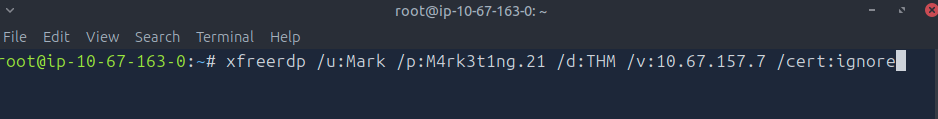

Tried to open Control Panel — blocked by the GPO as expected.

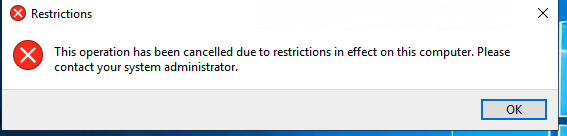

Waited 5 minutes idle — the screen auto-locked, confirming the Auto Lock Screen GPO worked too.

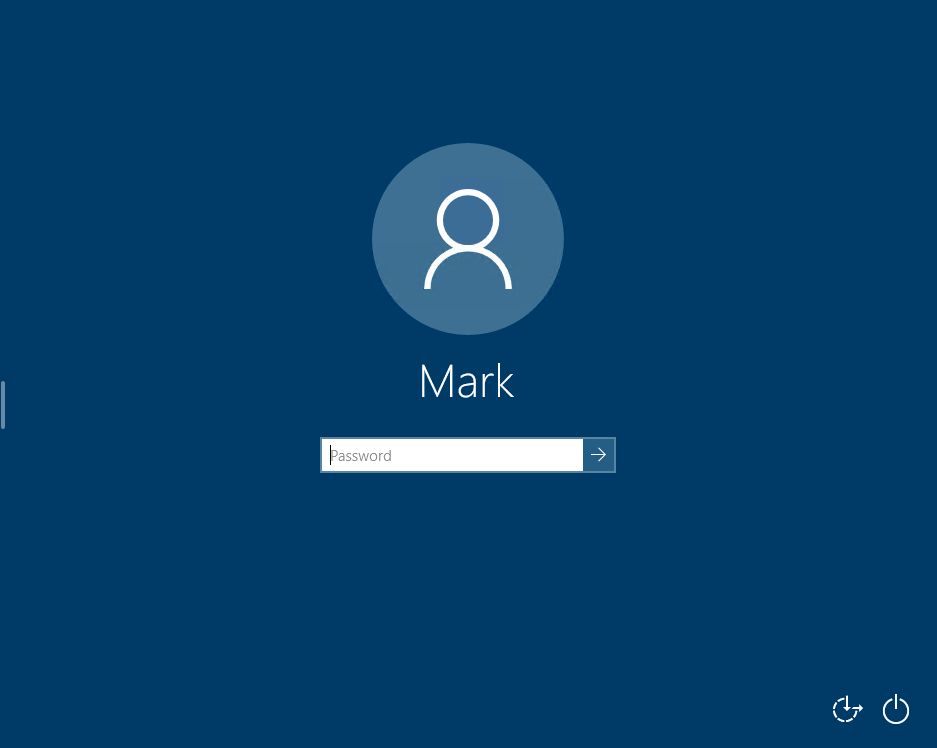

---

## Task 7 — Authentication Methods

Conceptual task covering the two Windows authentication protocols:

- **Kerberos** — modern default. Uses tickets (TGT and TGS) issued by the KDC so users don't have to re-send credentials for every service.
- **NetNTLM** — legacy challenge-response protocol. Still enabled in most networks for backwards compatibility. Never sends the actual password over the network, but considered weaker than Kerberos.

---

## Task 8 — Trees, Forests, and Trusts

Conceptual task covering multi-domain AD:

- **Tree** — multiple domains sharing the same namespace (e.g., `thm.local`, `uk.thm.local`, `us.thm.local`).
- **Forest** — multiple trees with different namespaces joined together (e.g., a `thm.local` tree and an `mht.local` tree in one forest).
- **Trust Relationships** — what enables cross-domain access. The trust direction is *opposite* to the access direction: if Domain A trusts Domain B, users in B can access resources in A.

---

## Task 9 — Conclusion

Room completed (100%).
